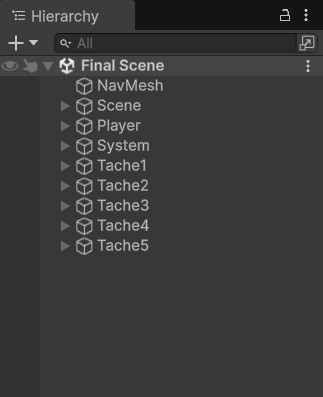

## Démonstration
Lien vidéo :  https://youtu.be/Afxc--FR4jo

---

##  Description du projet

Ce projet contient **deux scènes principales** :
- **Final Scene** : scène réalisée pour ce TP
- **Premier Scene** : scène de TD

Dans la **Final Scene**, l’ensemble des fonctionnalités a été organisé par tâche.

## 1. Tâche 1

#### 1.1 Contrôle de l’ambiance
Le système de contrôle de l’ambiance comprend **deux modes** :
- Mode Calme
- Mode Événement

On peut changer de mode en **cliquant directement sur l’écran à l’aide de la souris**.  

#### 1.2 Interface de choix du mode de visite
On peut aussi changer de mode en **cliquant directement sur l’écran à l’aide de la souris**. Après chaque changement, le mode sélectionné est **enregistré par PlayerPrefs**

---

### 2. Tâche 2 – Système de portes intelligentes

Les **portes intelligentes** s’ouvrent et se ferment automatiquement lorsque le **joueur** ou le **PNJ guide** s’approche.

Un signal lumineux indique l’état de la porte :
- Lumière verte : porte ouverte
- Lumière rouge : porte fermée

---

### 3. Tâche 3 – Installation artistique interactive
On peut interagir avec l’écran situé à côté de l’œuvre afin **d’activer le mode souhaité**

---

### 4. Tâche 4 – Mode *Visite libre*

Le **mode Visite libre** permet de se déplacer librement dans l’espace d’exposition et de **déclencher manuellement la présentation de chaque œuvre**.  

---

### 5. Tâche 5 – Mode *Visite guidée par PNJ*
Le **mode Visite guidée** active un **PNJ guide**, et le joueur doit suivre le PNJ.